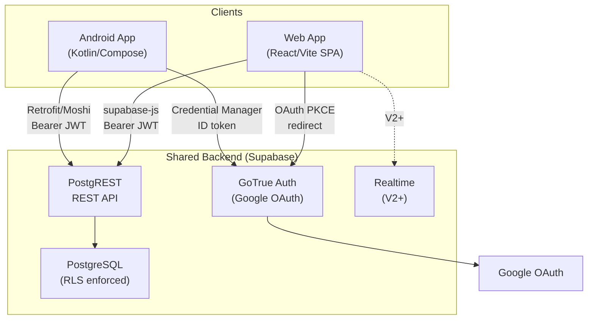

# System Architecture SDD (01)

> **Status:** ACTIVE
> **Scope:** Defines the cross-platform system architecture for the Dhruv ecosystem (Android + Web + Backend).

## 1. System Context

Dhruv is a multi-platform personal life ecosystem. Both platforms consume a shared backend (Supabase) as "dumb clients". Business logic and validation are implemented client-side, while access control and data security are enforced server-side.

### 1.1 Components

- **Android App (Primary)**: Kotlin, Jetpack Compose, Koin, Room (local cache/tools), Retrofit (REST).
- **Web App**: Vite, React 19 SPA, TypeScript, React Query, supabase-js. Hosted on Vercel.
- **Backend (Supabase)**: PostgreSQL (data), GoTrue (auth), PostgREST (API), Realtime.
- **External Services**: Google OAuth (identity), Exchange Rate API (FX), Cloudflare Worker (planned AI proxy).

### 1.2 System Topology Diagram

## 2. Multi-App Architecture

The Android monorepo plans 5 distinct apps. The web app is structured as a monorepo containing route-based modules corresponding to each Android app.

| Android App | Web Route Prefix | Status | Data Source |
|---|---|---|---|
| `:apps:finance` | `/finance/*` | V1 | Supabase + local (calculator history) |
| `:apps:tools` | `/tools/*` | V2 (scaffolded) | Supabase + local |
| `:apps:vault` | `/vault/*` | V3 (scaffolded) | Supabase + WebCrypto (client-side E2E) |
| `:apps:health` | `/health/*` | Future | Supabase |
| `:apps:relationship`| `/relationship/*`| Future | Supabase |

## 3. Technology Stack Matrix

| Layer | Android | Web |
|---|---|---|
| Language | Kotlin 2.2 | TypeScript 5.x |
| UI | Jetpack Compose (Material 3) | React 19 + Vanilla CSS Variables |
| DI / State | Koin + StateFlow (MVVM) | React Context + React Query |
| Local Storage| Room + EncryptedDataStore | In-memory + localStorage (session) |
| API Client | Retrofit + Moshi | supabase-js |
| Auth Flow | Credential Manager → GoTrue | OAuth PKCE → GoTrue |
| Feature Flags| Firebase Remote Config | Static JSON + React Context |

## 4. Cross-Cutting Concerns

### 4.1 Data Consistency
- The backend is the source of truth.
- Money is strictly stored as integer `paise` (`bigint` in Postgres, `Long` in Kotlin, `number` in TS).
- Time is stored as UTC `timestamptz`.

### 4.2 Feature Flags
- Single JSON schema (`dhruv-finance.json`).
- Features disabled via flags fallback to a `FeatureDisabledCard` UI component on both platforms.

### 4.3 Offline Strategy
- **Android**: Calculators are 100% offline. Tracker is cloud-primary (graceful degradation via UI banners).
- **Web**: Implemented as a PWA for an offline shell. Data access requires a network connection.

### 4.4 Non-Functional Requirements (NFRs)
- **Cost**: Zero server costs. Vercel free tier + Supabase free tier.
- **Latency**: SPA routing after initial load; Optimistic updates via React Query.
- **Security**: Strict RLS. No PII logged. DPDP consent required before processing.
